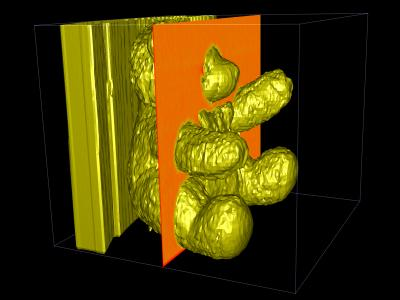
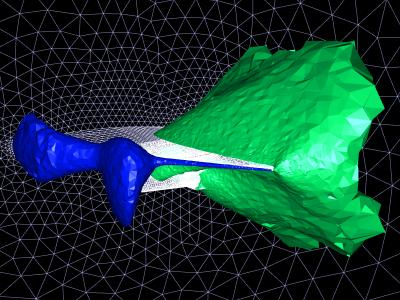
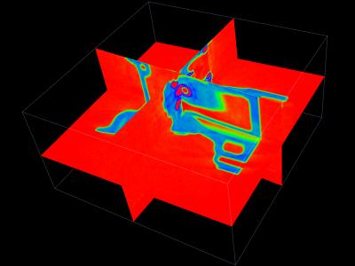
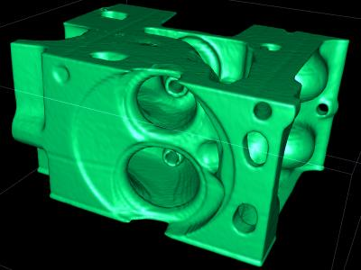
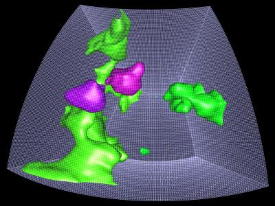
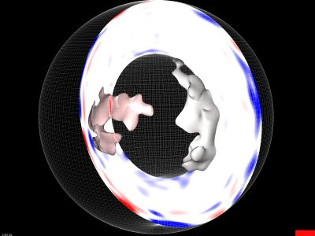
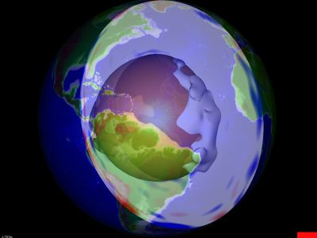
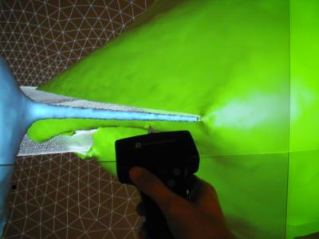

# Check out the 3D Visualizer in action!

## Videos 

### CAT Scan:
Using an HTC Vive commodity head-mounted display, a user explores a CAT scan of a patient with severe head trauma.

<iframe width="1000" height="400" src="https://www.youtube-nocookie.com/embed/b52KCELCm0o" title="YouTube video player" frameborder="0" allow="accelerometer; autoplay; clipboard-write; encrypted-media; gyroscope; picture-in-picture; web-share" referrerpolicy="strict-origin-when-cross-origin" allowfullscreen></iframe>

### Reconstruction of Earth's Crust and Mantle:
Using an HTC Vive commodity head-mounted display, a user explores a 3D seismic tomographic reconstruction of the Earth's crust and mantle underneath the western United States.

<iframe width="1000" height="400" src="https://www.youtube-nocookie.com/embed/O2LonOqpXoE" title="YouTube video player" frameborder="0" allow="accelerometer; autoplay; clipboard-write; encrypted-media; gyroscope; picture-in-picture; web-share" referrerpolicy="strict-origin-when-cross-origin" allowfullscreen></iframe>

## Images

Below are a series of screen shots from various data sets visualized using our exploration framework.

### Teddybear CT Dataset:
Visualized with a color-mapped slice and a flat-shaded isosurface.

### Wing Geometry Isosurfaces:
Compression and decompression zones visualized on a wing dataset. Dataset courtesy of Paresh Parikh, ViGYAN, Inc.

### Engine Block CT Slices:
Visualized using three pairwise orthogonal slices.

### Engine Block Isosurface:
Smooth-shaded isosurface visualization of the same dataset above.

### Mantle Convection Data:
Several isosurfaces in a "fake" mantle convection data set sampled on an earth-fitted curvilinear grid.

### Seismic Tomography of the Earth's Mantle:
A color-mapped slice and several isosurfaces visualizing a model of seismic wave velocities in the Earth's mantle computed via seismic tomography. The model is evaluated on an Earth-fitted curvilinear grid. Low-velocity regions are colored red and high-velocity regions are colored blue. The isosurfaces show the alleged "superplumes" underneath Africa and the Pacific. Dataset courtesy of Barbara Romanowicz, UC Berkeley Seismological Lab. 

### Seismic Tomography with Topography Overlay: 
The same dataset as above, now overlaid with a topographical map of Earth.

### Exploring the Parikh Wing Dataset: 
A user interacts with the Parikh wing dataset on our tiled display wall. 

## More!

More examples of VR data exploration via 3D Visualizer can be found at [youtube.com/@okreylos](https://www.youtube.com/@okreylos/videos). 